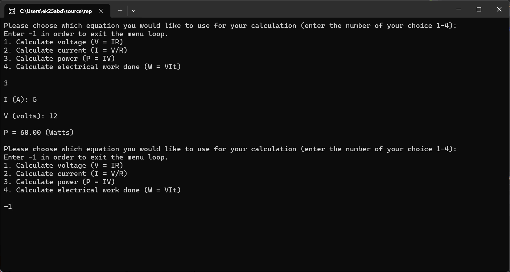

# Circuit Calculator

## Features
- Displays a menu of electrical equations
- Makes use of Ohm's law, electrical power and work done equations
- Calculations can be repeated
- Calculated value is given to two decimal places
- Inputs of zero can be handled
- Use of units to reduce errors in calculations

## Description
This C-based circuit calculator displays a menu of equations involving Ohm's law and the electrical power equations, and calculates the required variables, such as voltage and current.

Each equation corresponds to a number which the user must choose from. The user can repeat this process of selecting an equation, entering the known variables, and receiving a calculated result multiple times with the use of a do-while loop. The user can exit this loop by entering -1. The result of the calculation is given to two decimal places.

The user has four options:
- Ohm's law to calculate voltage (V = IR) or current (I = V/R)
- Electrical power (P = IV)
- Electrical work done (W = VIt)

The variable units are specified so that miscalculations are prevented, including volts, amps, ohms, watts and joules.

The code takes into account that the user may accidentally input 0 for the value of resistance in I = V/R. In such case, the user will be warned that the number they have entered is not an acceptable input and that numbers cannot be divided by 0.

## Screenshot

## How to run the code
- Open the project in a C compiler, such as Visual Studio
- Build the program
- Run the program
- Follow the instructions displayed on the screen

## Technologies used
- C language
- Visual Studio
